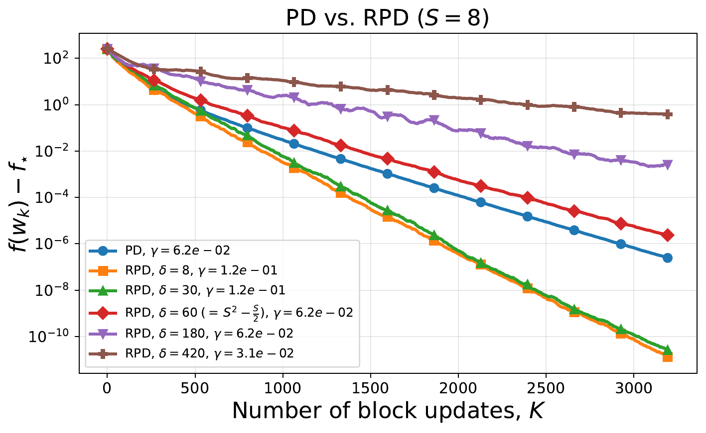
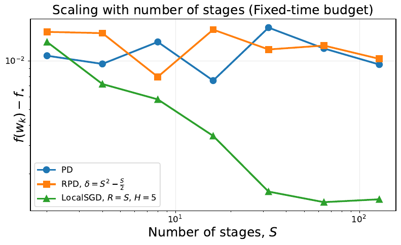

# Randomized PipeDream

[](https://arxiv.org/abs/2606.03498)

Code for studying PipeDream-style pipeline training and randomized stale block-gradient abstractions on small, inspectable objectives.

The `main` branch contains the simple-objective experiments used to debug schedules, weight stashing, stale reads, and convergence curves. The `llm-experiments` branch contains small nanochat-style experiments built around a compact character-level transformer objective.

<table>
  <tr>
    <td width="50%">
      <a href="pdf/pd_vs_RPD_different_delta_rand_quad.png">
        
      </a>
    </td>
    <td width="50%">
      <a href="pdf/fixed_time_scaling_vs_stages_three_methods.png">
        
      </a>
    </td>
  </tr>
  <tr>
    <td>
      Random quadratic objective: best-tuned PD and RPD trajectories. S=8, batch size is 10, M=60, trained for 5 epochs.
    </td>
    <td>
      Logistic regression: final objective versus the number of stages S under a fixed simulator-time budget. Batch size is 10, M=60, trained for 5 epochs. H=5, lambda=1e-4.
    </td>
  </tr>
</table>

The left plot validates RPD as a theoretical proxy for PD: when RPD is instantiated in the delay regime predicted for steady-state 1F1B execution, its trajectory closely matches PD on the quadratic objective. The right plot studies scaling on logistic regression: for each method and each stage count S, it reports the final objective reached under the same fixed simulator-time budget with d=512.

## Paper

**Paper:** [Demystifying Pipeline Parallelism: First Theory for PipeDream](https://arxiv.org/abs/2606.03498)

...or you can read my [blog post](https://ivanilin.org/projects/pipeline-parallelism-theory/) on it.

## Branches

- `main`: simple synthetic objectives, including block-partitioned quadratic and logistic-regression objectives.
- `llm-experiments`: small PyTorch language-model experiments using `SimpleLLMObjective`, toy text, optional Tiny Shakespeare data, and wall-clock-style schedule comparisons.

Switch to the LLM branch with:

```bash
git fetch origin
git switch llm-experiments
```

## What Is Included

- `main.py`: exploratory runner for schedule plots, delay statistics, and comparison figures.
- `configs/`: YAML configs for quadratic PipeDream, GPD, SGD, and comparison runs.
- `scripts/run_experiment.py`: config-driven single-method experiment runner.
- `scripts/run_sweep.py`: simple parameter sweep helper.
- `scripts/make_figure.py`: comparison plotting entry point.
- `llm_experiments.py`: PipeDream vs GPD/RPD on the small LLM objective.
- `llm_pd_vs_sgd.py`: PipeDream vs local minibatch SGD on the small LLM objective.
- `src/objectives/`: quadratic, logistic-regression, and simple LLM objectives.
- `src/schedulers/`: 1F1B PipeDream, naive pipeline, and independent local-SGD schedules.
- `src/methods/`: PipeDream, GPD, and local-SGD simulation methods.
- `src/state/`: microbatch state, traces, timelines, and weight-version tracking.
- `src/plotting/`: convergence and schedule plotting utilities.
- `notebooks/`: exploratory notebooks and archived figures from earlier experiments.

## Methods

The simple-objective experiments model a block-partitioned parameter vector whose blocks correspond to pipeline stages. They compare:

- PipeDream-style 1F1B execution with weight stashing.
- GPD/RPD-style randomized stale block-gradient updates.
- Minibatch SGD baselines in the simple-objective notebooks/configs.
- Local minibatch SGD baselines in the LLM experiments.

PipeDream is replayed from an explicit pipeline timeline. The simulation tracks forward and backward weight versions and verifies that each microbatch-stage pair uses the same stashed weights on the forward and backward pass.

GPD/RPD samples a stage, batch, and stale mixed model, then updates only the active block. The implementation can use uniform stale reads or delays derived from a PipeDream timeline.

## Setup

Python 3.10+ is recommended.

```bash
python3 -m venv .venv
source .venv/bin/activate
python3 -m pip install --upgrade pip
python3 -m pip install -e .
```

The LLM experiments require PyTorch:

```bash
python3 -m pip install torch
```

If you use the logistic-regression objective directly, install SciPy as well:

```bash
python3 -m pip install scipy
```

## Simple-Objective Workflow

Run the quadratic experiments from the `main` branch:

```bash
python3 -m scripts.run_experiment configs/quadratic_pipedream.yaml
python3 -m scripts.run_experiment configs/quadratic_gpd.yaml
python3 -m scripts.run_experiment configs/quadratic_sgd.yaml
```

Create a comparison figure:

```bash
python3 -m scripts.make_figure configs/comparison.yaml
```

Run the exploratory debug script:

```bash
python3 main.py --save-dir results/debug_main
```

Run the tests:

```bash
python3 -m pytest -q
```

## LLM Workflow

Use the `llm-experiments` branch for the nanochat-style experiments:

```bash
git switch llm-experiments
```

Run PipeDream vs GPD/RPD on the toy character dataset:

```bash
python3 llm_experiments.py \
  --dataset toy \
  --num-stages 4 \
  --num-microbatches 16 \
  --save-dir results/llm_experiments
```

Run PipeDream vs local minibatch SGD with matched schedule length:

```bash
python3 llm_pd_vs_sgd.py \
  --dataset toy \
  --target-time-steps 64 \
  --save-dir results/llm_pd_vs_sgd
```

Use Tiny Shakespeare instead of the toy data with:

```bash
python3 llm_experiments.py --dataset tiny_shakespeare
```

The first Tiny Shakespeare run downloads the text into `data/llm/`.

## Outputs

The runners write plots and trace artifacts under `results/`, including:

- schedule plots such as `pipedream_schedule.png`
- convergence plots such as `comparison_linear.png` and `comparison_log.png`
- LLM time-comparison plots such as `comparison_time_linear.png` and `comparison_time_log.png`
- curve archives such as `curves.npz`
- run summaries such as `summary.json`
- optional learning-rate sweep plots when `--tune-stepsizes` is enabled

Representative simple-objective outputs are kept in `results/debug_main/` and `results/figures/`.

## Citation

If you use this code, please cite the accompanying paper.

```bibtex
@article{randomizedpipedream2026,
  title={Demystifying Pipeline Parallelism: First Theory for PipeDream},
  author={Ilin, Ivan and Richt{\'a}rik, Peter},
  journal={arXiv preprint arXiv:2606.03498},
  year={2026}
}
```
